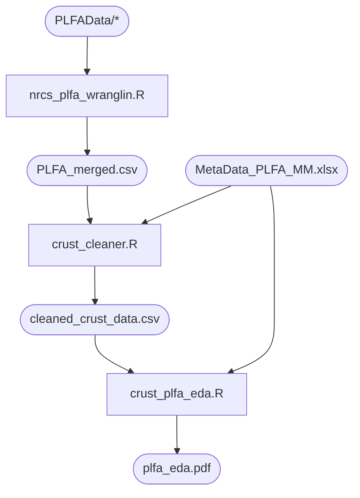
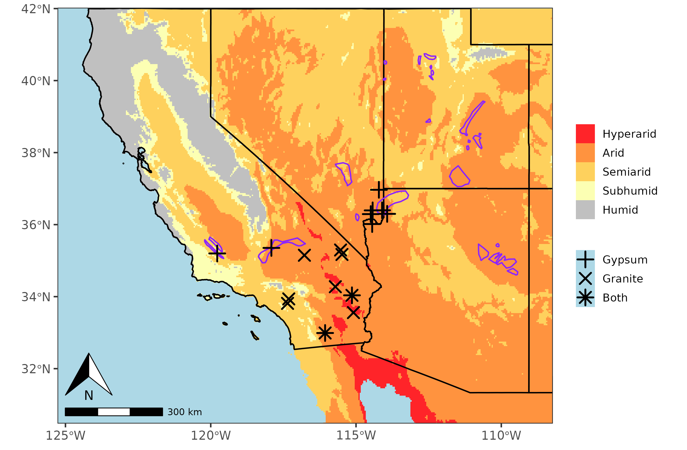
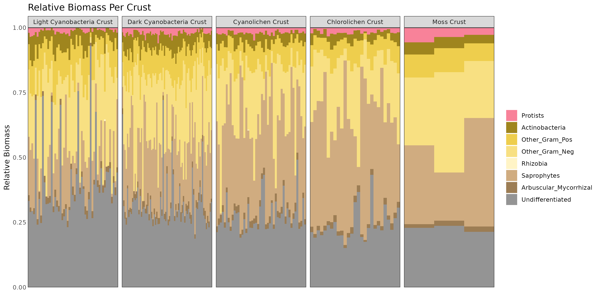

# NRCS Data Wranglin

This repository contains a data wrangling pipeline for the Pietrasiask lab. The pipeline takes 2 main inputs in its current state: `MetaData_PLFA_MM.xlsx` and a directory of csv files `PLFAData`
 
The metadata file defines the samples that are used in the final report as well as several categorical ecological variables. In this file, the column name that defines the SampleID is `Sample ID 2`, which is the ID used to match metadata to data aggregated from PLFA csvs.

The `PLFAData` directory is full of CSVs from a third party who measured various biomass markers. Importantly, the same `Sample ID 2` column must be present in each file to provide each sample with a unique identifier. Negligible measurements ('<0.01') are collapsed to 0 for computational purposes.

The data comes from a large range of arid climates, providing insight on microclimates, lichen demographics and substrate specificity in the American Southwest.

