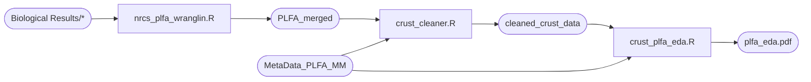

NRCS Data Wranglin

```mermaid
flowchart LR
    A([PLFA_merged]) --> B[crust_cleaner.R]
    C([MetaData_PLFA_MM]) --> B
    B --> D([cleaned_crust_data])
    D --> E[crust_plfa_eda.R]
    C --> E
    E --> F([plfa_eda.pdf])
    G([Biological Results/*]) --> H[nrcs_plfa_wranglin.R]
    H --> A
```
